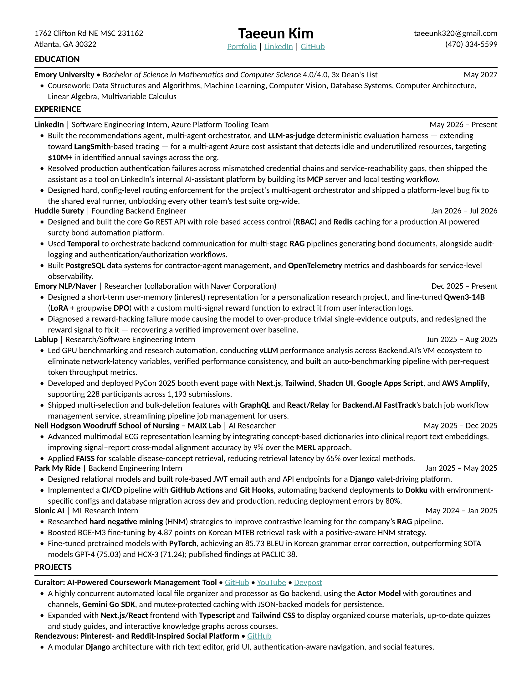
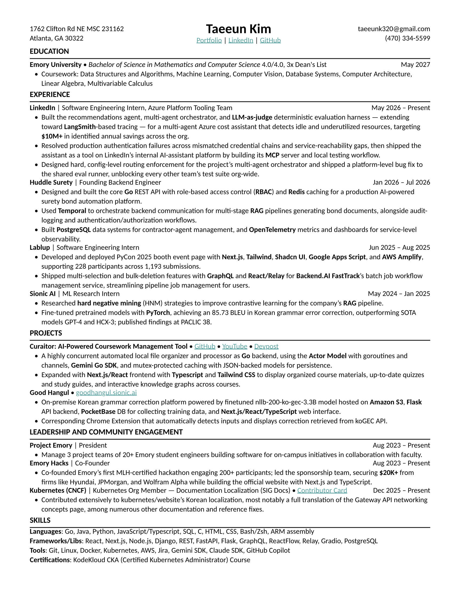
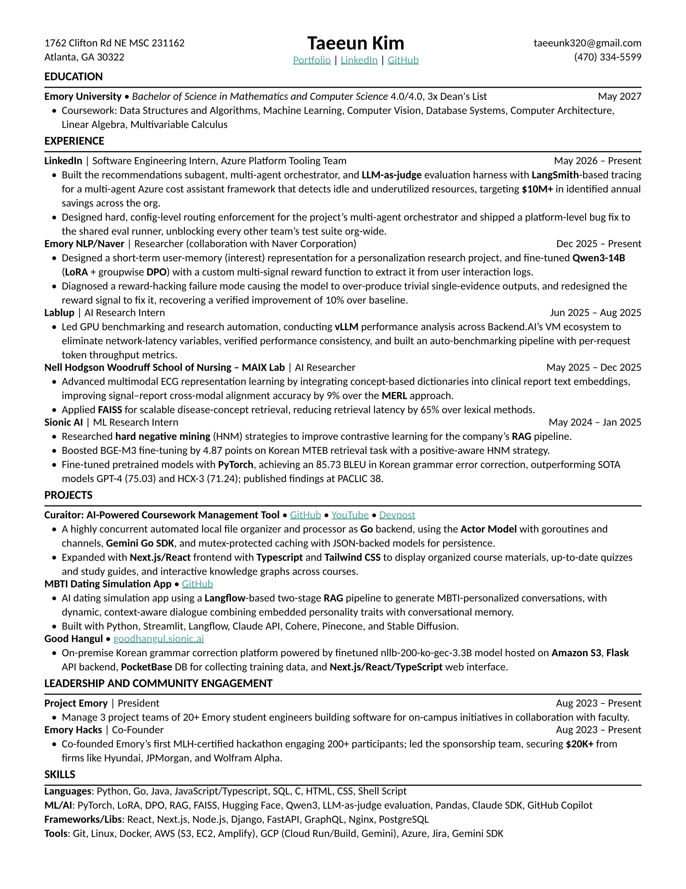

# Resume Builder (Typst + YAML)

| [Full CV](resume.pdf) | [SWE Resume](resume-swe.pdf) | [ML/Research Resume](resume-ml.pdf) |
|:---:|:---:|:---:|
|  |  |  |

This repo holds three resume variants, all sharing the same layout/template:

- **`resume.yaml`** → `resume.pdf` — the complete, everything-included CV
  (not role-targeted, can run to 2 pages).
- **`resume-swe.yaml`** → `resume-swe.pdf` — a 1-page resume targeted at
  full-stack / backend / platform SWE roles.
- **`resume-ml.yaml`** → `resume-ml.pdf` — a 1-page resume targeted at
  ML/AI research roles.

Content and layout are fully separated:

- **`resume*.yaml`** — all the actual content (name, contact info,
  education, experience, projects, leadership, skills). **These are the
  only files you should normally edit** to update your resume(s).
- **`resume*.typ`** — a [Typst](https://typst.app) template that defines the
  layout/styling (fonts, spacing, section rules, bold/italic treatment,
  right-aligned dates, bullets, links) for its matching `.yaml`. Edit these
  only if you want to change how a resume *looks*, not its content.

Edit the YAML, see the PDF update live, export a final PDF with one command.

## Prerequisites

You need two CLI tools: **Typst** (compiles `.typ` → PDF) and **tinymist**
(Typst's language server, used here for live preview). Both are free,
open-source, and available on macOS, Linux, and Windows.

### macOS (Homebrew)

```sh
brew install typst
brew install tinymist
```

### Linux

```sh
# Typst
cargo install --locked typst-cli
# or download a prebuilt binary from https://github.com/typst/typst/releases

# tinymist
cargo install --locked tinymist
# or download a prebuilt binary from https://github.com/Myriad-Dreamin/tinymist/releases
```

(Most distros also have `typst` in their package manager, e.g. `pacman -S
typst` on Arch.)

### Windows

```powershell
winget install --id Typst.Typst
winget install --id Myriad-Dreamin.tinymist
```

### Verify install

```sh
typst --version
tinymist --version
```

## Fonts

The template uses **Carlito** by default — a free, metrically-compatible
clone of Microsoft's Calibri (same letterforms/spacing, different name, no
license issues). It's *not* preinstalled on any OS, so install it separately:

```sh
# macOS
brew install --cask font-carlito

# Linux (Debian/Ubuntu)
sudo apt install fonts-crosextra-carlito

# Windows
# Download from https://github.com/google/fonts/tree/main/apache/carlito
# and install the .ttf files via right-click > Install.
```

If Carlito isn't installed, Typst will silently fall back to the next font
in the list (currently `Arial`), so nothing breaks — the resume will just
render in a different font until you install it.

To confirm Typst can see it:

```sh
typst fonts | grep -i carlito
```

### Using a different font

Only preinstalled system fonts are guaranteed to work without extra setup —
e.g. `Helvetica`/`Arial` (macOS/Windows), `Times New Roman`, `Georgia`. To
change the font, edit the `#set text(font: (...))` line near the top of
`resume.typ`:

```typ
#set text(font: ("Carlito", "Arial"), size: 9.7pt, lang: "en")
```

The list is tried in order — the first installed font wins. Run `typst
fonts` to see every font Typst can currently find on your system.

## Workflow

### 1. Live preview while editing

```sh
make watch
```

This runs `tinymist preview resume.typ`, which opens a live preview in your
browser and recompiles automatically every time you save `resume.yaml` or
`resume.typ`. Keep it running in a terminal tab while you edit.

Stop it with `Ctrl+C`. **Restart it** any time you install a new font or it
seems out of date — it only scans fonts once at startup.

### 2. Edit your content

Open `resume.yaml`. Each section (`education`, `experience`, `projects`,
`leadership`, `skills`) is a list of entries — copy an existing entry's shape
to add a new one, or delete one you no longer need.

Bullet text supports lightweight inline formatting:

- `*bold text*` → **bold text**
- `_italic text_` → _italic text_
- `#link("https://example.com")[link text]` → an inline clickable link

Several links in `resume.yaml` are marked `# TODO` with placeholder URLs
(portfolio, LinkedIn, GitHub, project repos, etc.) — replace those with your
real URLs before exporting.

### 3. Export a final PDF + preview image

```sh
make build
```

Runs one `typst compile` for the PDF and one for a PNG preview, writing
`resume.pdf` and `resume-preview.png` together. Use this whenever you want
a one-off export without a watcher running, or to refresh the README image.

### 4. Working with the resume variants

This repo holds three resume variants side-by-side: `resume` (full CV),
`resume-swe` (SWE-targeted), and `resume-ml` (ML/research-targeted). Each is
a `resume-<name>.yaml` + `resume-<name>.typ` pair. Every command above
accepts `FILE=<name>` to target one:

```sh
make watch FILE=swe        # live preview resume-swe.typ
make build FILE=ml         # export resume-ml.pdf + resume-ml-preview.png
```

`FILE` defaults to `resume` (the full CV). No new Makefile targets are
needed to add another variant — just create the `resume-<name>.yaml`/`.typ`
pair and pass `FILE=<name>`.

### 5. Clean up generated files

```sh
make clean
```

Removes every generated PDF/PNG across all variants.

## Changing the look

All layout lives in `resume.typ`:

- **Font/size**: the `#set text(...)` line near the top.
- **Page margins**: the `#set page(...)` block.
- **Line/paragraph spacing**: `#set par(leading: ...)`. Keep this equal to
  `#set block(spacing: ...)` and the `spacing:` in `#set list(...)` so that
  wrapped lines, bullet-to-bullet gaps, and section-to-section gaps all stay
  visually consistent.
- **Section header style** (bold caps + rule): the `section()` function.
- **Bullet marker/spacing**: the `#set list(...)` line.
- **Link color**: the `accent` variable.

## Project structure

```
resume.yaml              content — the full CV (all entries, can be 2 pages)
resume.typ               layout/template for resume.yaml
resume-swe.yaml/.typ     1-page SWE-targeted resume + its template
resume-ml.yaml/.typ      1-page ML/research-targeted resume + its template
Makefile                 make watch / make build / make clean (FILE=<name> selects the variant)
resume*.pdf              generated output (safe to delete/regenerate anytime)
resume*-preview.png      generated PNG previews, shown at the top of this README
knowledgebase/           private source material behind each resume entry (see its own README)
LICENSE                 MIT license
```

## Using this as a template for your own resume

1. Fork or copy this repo.
2. Replace everything in `resume.yaml` with your own content.
3. Run `make watch`, tweak `resume.typ` if you want a different look, and
   iterate until it matches what you want.
4. Run `make build` to export.
